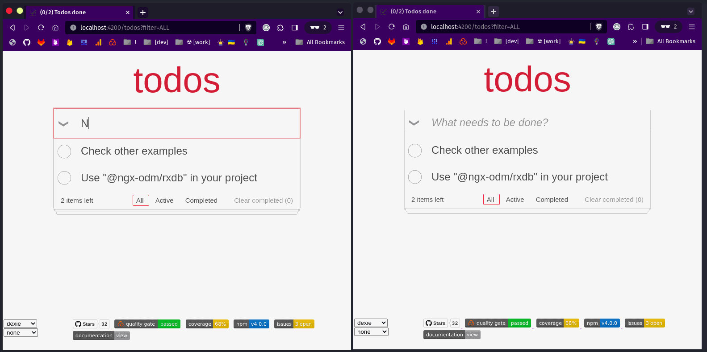
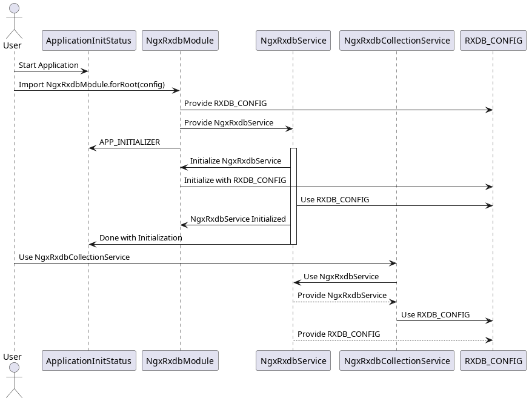
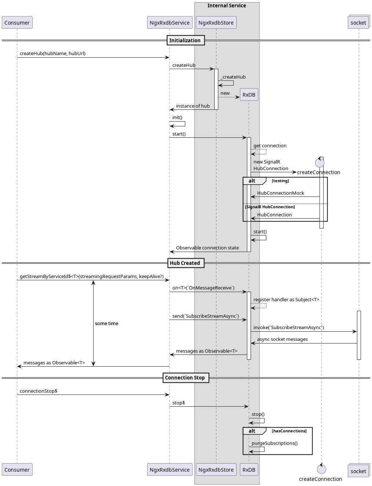

# @ngx-odm/rxdb

> Angular 14+ wrapper for **RxDB** - A realtime Database for the Web

## Demo



[demo](https://voznik.github.io/ngx-odm/) - based on TodoMVC

## Table of contents

- [@ngx-odm/rxdb](#ngx-odmrxdb)
  - [Demo](#demo)
  - [Table of contents](#table-of-contents)
  - [General info](#general-info)
  - [Technologies](#technologies)
  - [Install](#install)
  - [Usage (NgModule)](#usage-ngmodule)
    - [In your `AppModule`](#in-your-appmodule)
    - [In your `FeatureModule`](#in-your-featuremodule)
    - [In your `FeatureService`](#in-your-featureservice)
  - [Usage (Standalone)](#usage-standalone)
    - [In your `main.ts`](#in-your-maints)
    - [In your `Component`](#in-your-component)
    - [Using `sginals` \& `signalStore` from `@ngrx/signals`](#using-sginals--signalstore-from-ngrxsignals)
  - [Features](#features)
  - [Status](#status)
  - [Inspiration](#inspiration)
  - [Notes](#notes)
  - [Contact](#contact)

## General info

If you don't want to setup RxDB manually in your next Angular project - just import `NgxRxdbModule` or go with `provideRxDatabase` and `provideRxCollection` if standalone component is your choice.

## Technologies

| RxDB                                                                                                     | Angular 14+                                                                                   |
| -------------------------------------------------------------------------------------------------------- | --------------------------------------------------------------------------------------------- |
| [](https://rxdb.info/) | [](https://angular.io/) |

## Install

`npm install @ngx-odm/rxdb`

## Usage (NgModule)

### In your `AppModule`

```typescript
import { NgxRxdbModule } from '@ngx-odm/rxdb';
import { getRxDatabaseCreator } from '@ngx-odm/rxdb/config';

@NgModule({
  imports: [
    // ... other imports
    NgxRxdbModule.forRoot(
      getRxDatabaseCreator({
        name: 'demo', // <- name (required, 'ngx')
        storage: getRxStorageDexie(), // <- storage (not required, 'dexie')
        localDocuments: true,
        multiInstance: true, // <- multiInstance (optional, default: true)
        ignoreDuplicate: false,
        options: {
          storageType: 'dexie|memory', // <- storageType (optional, use if you want defaults provided automatically)
          dumpPath: 'assets/dump.json', // path to datbase dump file (optional)
        },
      })
    ),
  ],
  providers: [],
  bootstrap: [AppComponent],
})
export class AppModule {}
```

### In your `FeatureModule`

> Schemas define how your data looks. Which field should be used as primary, which fields should be used as indexes and what should be encrypted. The schema also validates that every inserted document of your collections conforms to the schema. Every collection has its own schema. With RxDB, schemas are defined with the jsonschema-standard which you might know from other projects.
> https://rxdb.info/rx-schema.html

```typescript
import type { RxCollectionCreatorExtended } from '@ngx-odm/rxdb/config';
// create or import your schema
const todoSchema: RxSchema = require('../../../assets/data/todo.schema.json');
// create config
const todoCollectionConfig: RxCollectionCreatorExtended = {
  name: 'todo', // <- name (required)
  schema: todoSchema, // <- schema (not required, see below)
  localDocuments: true,
  options: {
    initialDocs: [], // docs to be imported into empty collection (optional)
    schemaUrl: 'assets/data/todo.schema.json', // load schema from remote url (optional)
    replicationStateFactory: collection => {
      // provide replication state (optional)
    },
  },
};

@NgModule({
  imports: [
    // ... other imports
    NgxRxdbModule.forFeature(todoCollectionConfig),
  ],
})
export class TodosModule {
  constructor(
    @Inject(NgxRxdbCollectionService) private collectionService: NgxRxdbCollection<Todo>
  ) {
    this.collectionService.sync(); // INFO: collection is ready
  }
}
```

### In your `FeatureService`

```typescript
@Injectable()
export class TodosService {
  private collectionService: NgxRxdbCollection<Todo> = inject<NgxRxdbCollection<Todo>>(
    NgxRxdbCollectionService
  );
  // store & get filter as property of a `local` document
  filter$ = this.collectionService
    .getLocal('local', 'filterValue')
    .pipe(startWith('ALL'), distinctUntilChanged());
  // get count of documents in collection as observable
  count$ = this.collectionService.count();

  // get documents from collection as observable
  // optionally using `RxQuery` mango-queries
  todos$: Observable<Todo[]> = this.collectionService.docs();

  // add new document
  add(name: string): void {
    const payload: Todo = { guid: uuid(), name, done: false, dateCreated: Date.now() };
    this.collectionService.insert(payload);
  }

  // update property of single document
  toggle(guid: string, done: boolean): void {
    this.collectionService.set(guid, { done });
  }

  // update many documents with partial data by query
  toggleAllTodos(completed: boolean) {
    this.collectionService.updateBulk(
      { selector: { completed: { $eq: !completed } } },
      { completed }
    );
  }

  // remove many dcouments by qeury
  removeCompletedTodos(): void {
    this.collectionService.removeBulk({ selector: { completed: true } });
  }
  // ...
}
```

## Usage (Standalone)

### In your `main.ts`

```typescript
import { provideRxDatabase } from '@ngx-odm/rxdb';
import { getRxDatabaseCreator } from '@ngx-odm/rxdb/config';

export const appConfig: ApplicationConfig = {
  providers: [
    // ... other providers
    provideRxDatabase(
      getRxDatabaseCreator({
        name: 'demo',
        localDocuments: true,
        multiInstance: true,
        ignoreDuplicate: false,
        storage: getRxStorageDexie(),
      })
    ),
  ],
};

bootstrapApplication(AppComponent, appConfig).catch(err => console.error(err));
```

### In your `Component`

```typescript
import { provideRxCollection } from '@ngx-odm/rxdb';

@Component({
  standalone: true,
  // ...
  providers: [provideRxCollection(config)],
})
export class StandaloneComponent {
  readonly todoCollection = inject(NgxRxdbCollectionService<Todo>);
}
```

### Using `sginals` & `signalStore` from `@ngrx/signals`

```typescript
import { signalStore } from '@ngrx/signals';
import { withEntities } from '@ngrx/signals/entities';
import { withCollectionService } from '@ngx-odm/rxdb/signals';
import { withDevtools } from '@angular-architects/ngrx-toolkit';

export const TodoStore = signalStore(
  { providedIn: 'root' },
  withDevtools('todo'),
  withEntities<Todo>(),
  // INFO: an instance of RxCollection will be provided by this
  withCollectionService<Todo, TodosFilter, RxCollectionCreatorExtended>({
    filter: 'ALL' as TodosFilter,
    collectionConfig: TodosCollectionConfig,
  }),
  ...
);

@Component({
  standalone: true,
  // ...
  providers: [TodoStore],
})
export class StandaloneComponent {
  readonly todoStore = inject(TodoStore);

  constructor() {
    effect(() => {
      const { filter, entities } = this.todoStore;
    });
  }
}
```

## Features

By using this module you can simplify your work with RxDB in Angular application:

- Automatically initialize db with settings
  - optionally provide db dumb to pre-fill collections
  - optionally provide array of initial documents to pre-fill collection
  - optionally provide remote location for schema and fetch it automatically before create collection (e.g. to maintain single source of truth for schema)
  - optionally provide syncronization with remote db (CouchDB, Kinto etc.) as DB options
- Automatically initialize RxCollection for each _lazy-loaded Feature module / standalone component_ with config
- Work with documents via _NgxRxdbCollectionService_ with unified methods instead of using _RxCollection_ directly (though you still have access to _RxCollection_ and _RxDatabase_ instance)
- Work with signals and entities with `@ngrx/signals` and `@ngrx/entity` (optionally _zoneless_) (see [example](examples/standalone/src/app/todos/todos.store.ts))

<!-- ## Diagrams


NgxRxdbModule Initialization UML


NgxRxdbModule Initialization UML -->

## Status

Project is: _in progress_

## Inspiration

Project inspired by

- [rxdb-angular2-example](https://github.com/pubkey/rxdb/blob/master/examples/angular2/README.md#rxdb-angular2-example)
- [Angular NgRx Material Starter](https://tomastrajan.github.io/angular-ngrx-material-starter#/examples/todos)
- _The Angular Library Series_ from [Angular In Depth](https://blog.angularindepth.com/)
- [NgRx Toolkit](https://github.com/angular-architects/ngrx-toolkit/blob/main/libs/ngrx-toolkit/src/lib/with-data-service.ts) - inspired by Manfred Steyer and created singnals tool by analogy of `withDataService` from [Angular Architects](https://angulararchitects.io/)

## Notes

## Contact

Created by [@voznik](https://github.com/voznik) - feel free to contact me!
